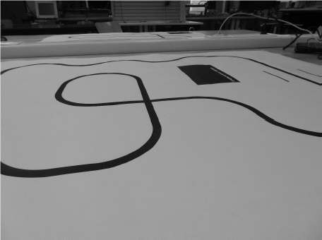

# LineFollower

lege repository die je als template kan gebruiken om een eigen repository te starten voor uw linefollower project

  
## specifications

microcontroller: Arduino nano (clone)

motors: N20---30:1---500RPM 

h-bridge: DRV8833

sensors: HY-S301

batteries: 2x 18650 lipo

wireless communication: HC-08 

distance sensor - motors: 9.92cm

weight: 214gr

speed: 0.7m/s (voorlopige stabiele snelheid)

